# Terraform-AWS-1
Terraform is an open-source tool created by **HashiCorp**. It is used for building, changing, and versioning infrastructure safely and efficiently. Terraform can manage existing and popular service providers as well as custom in-house solutions.

### For starting
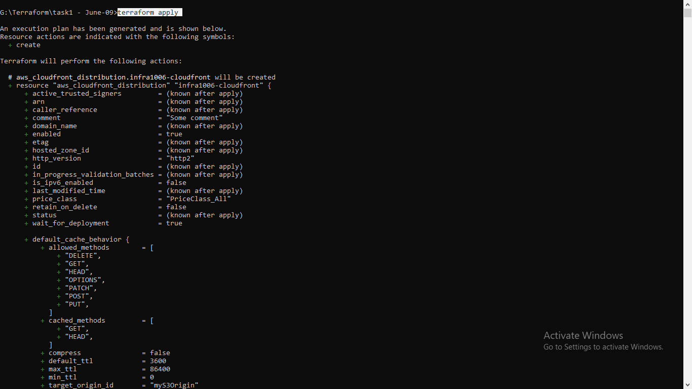
 
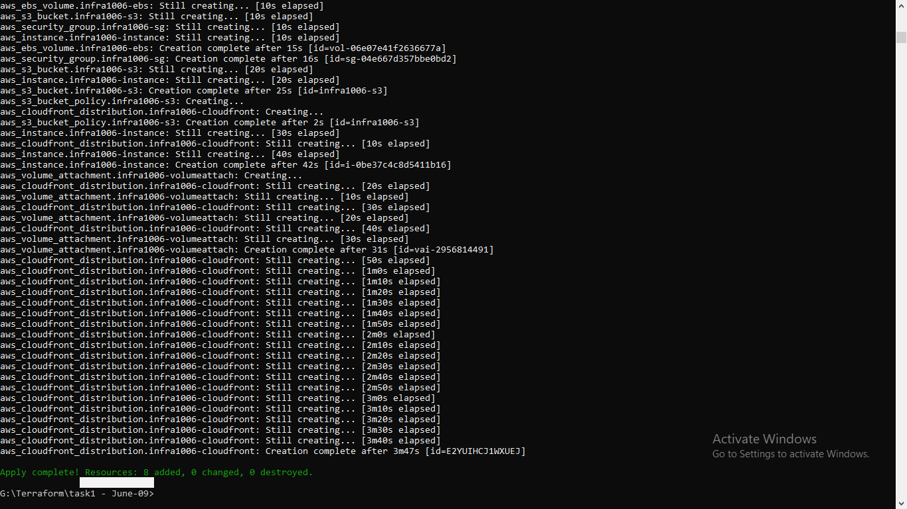

Here I have created a infrastructure in **HCL (Hashicorp Configuration Language)** which consists of 

### EC2 instance with configured Apache Server
  * Key Pair
  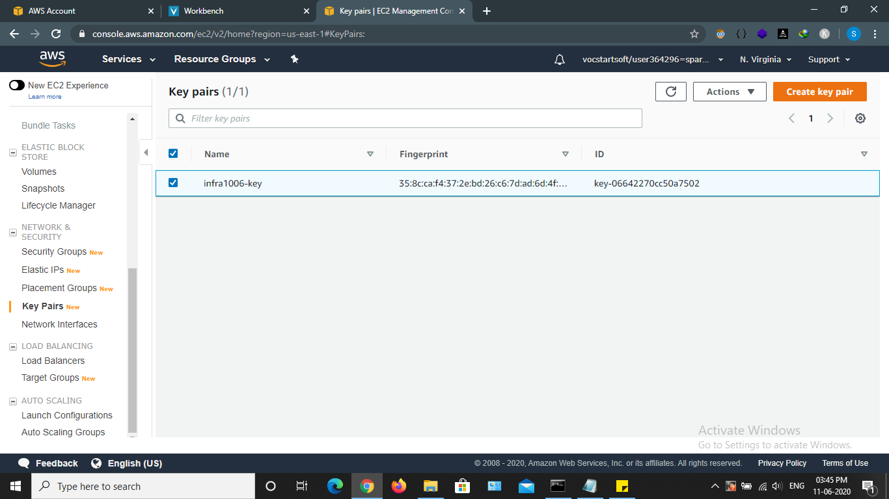
 
  * Security Group
  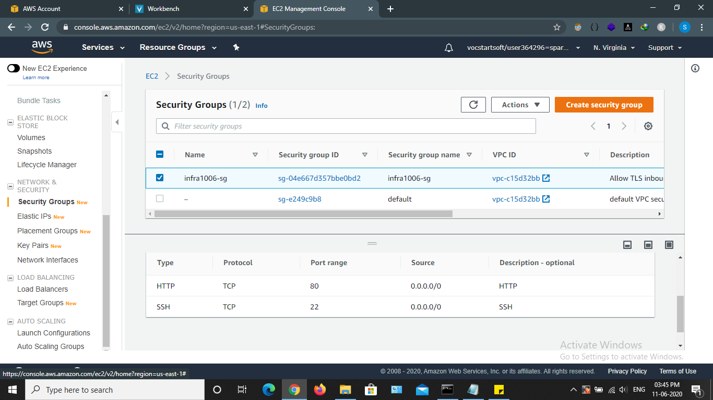
 
  * EBS Volume
  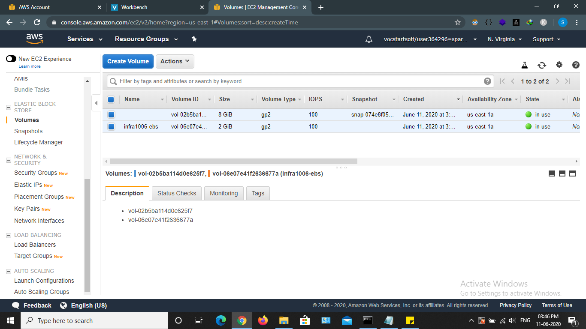
 
  * Instance
  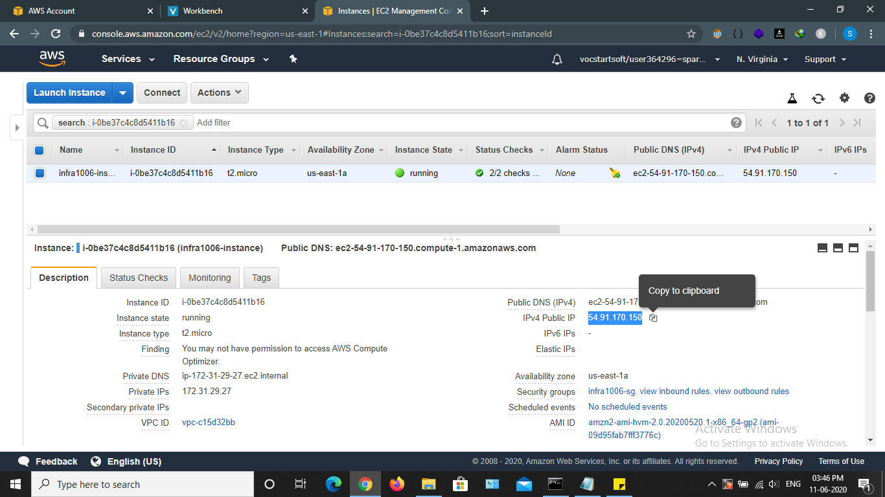
 
  
### S3 bucket with Public Access, consisting of all the data of GitHub repository
   * S3 bucket
   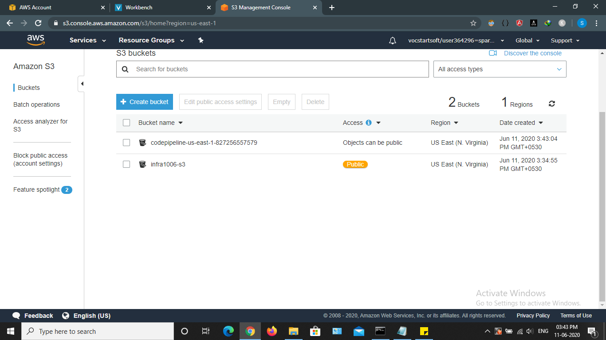
    
   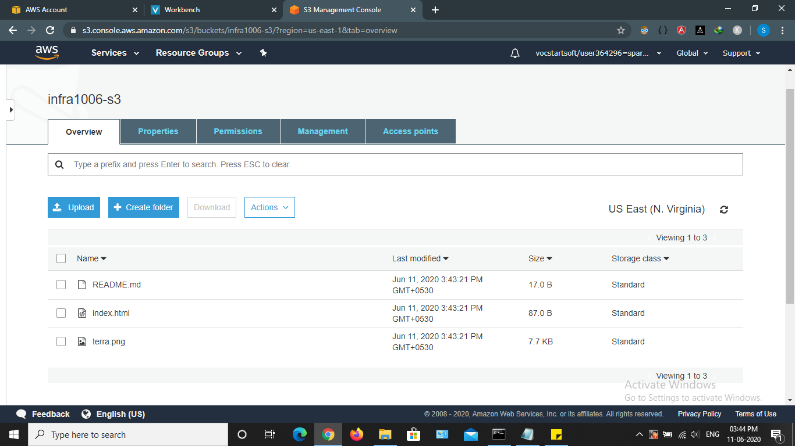
    
   
   * Bucket Policy
   
### CloudFront Distribution for S3 bucket
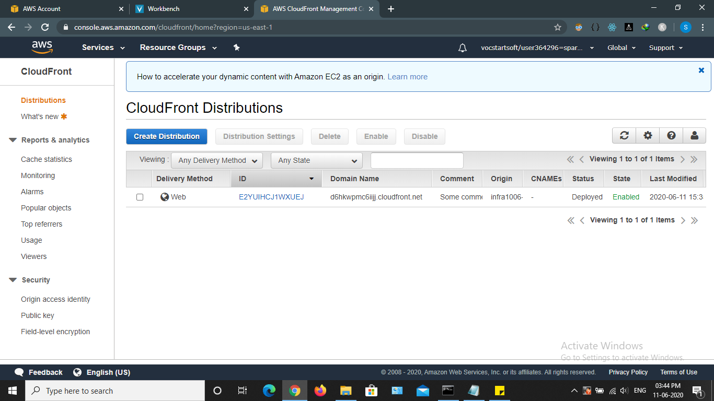
 

### CodePipeline for fully managed continous delievery that automatically copy the updates or pushes of GitHub repository into S3 bucket respectively
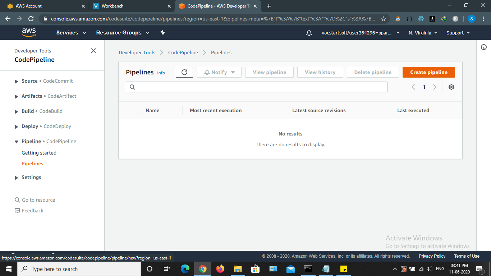
 
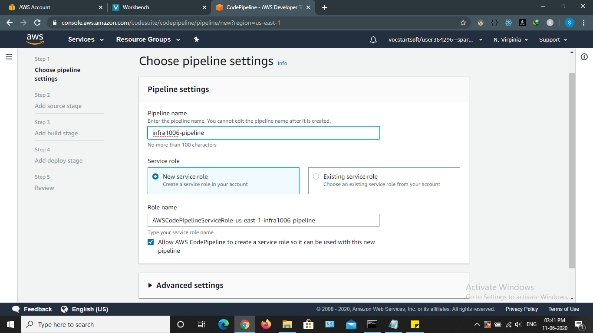
 
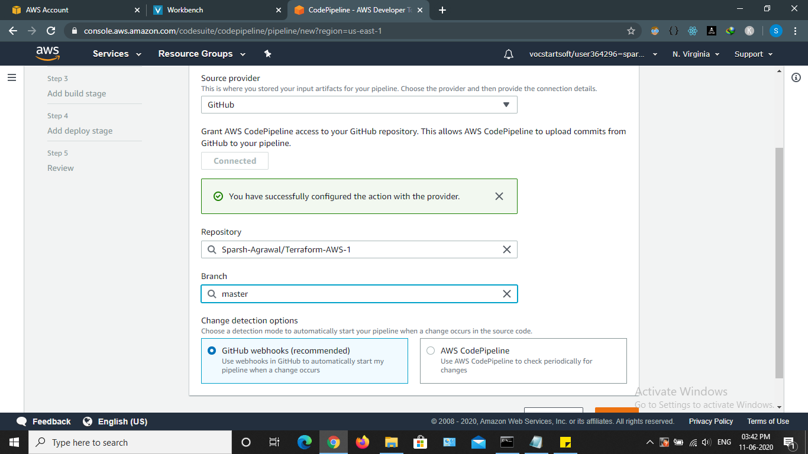
 
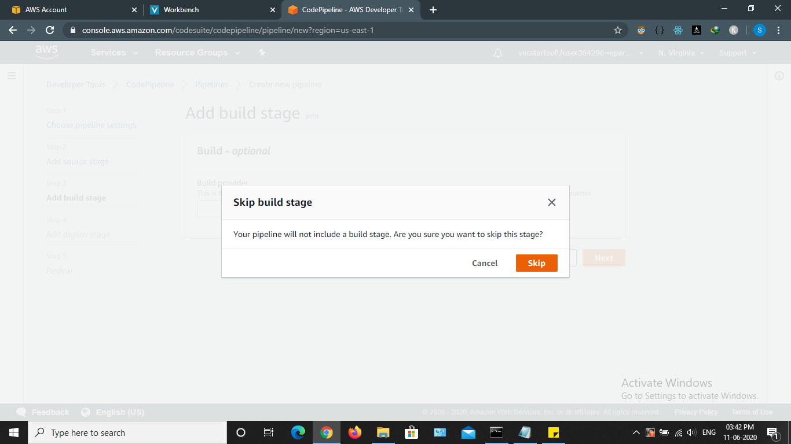
 
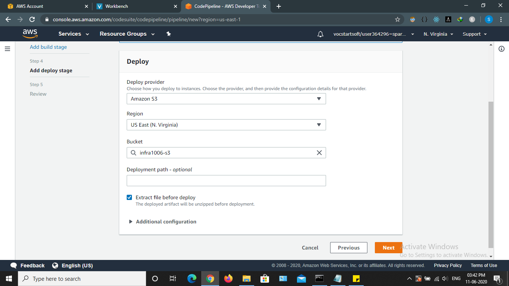
 
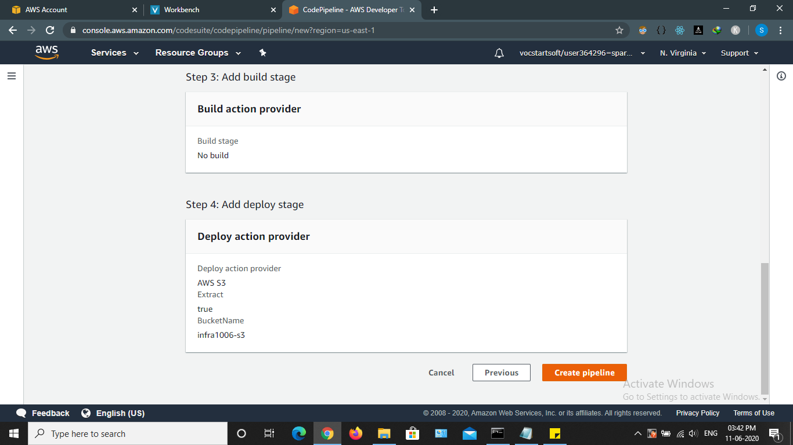
 
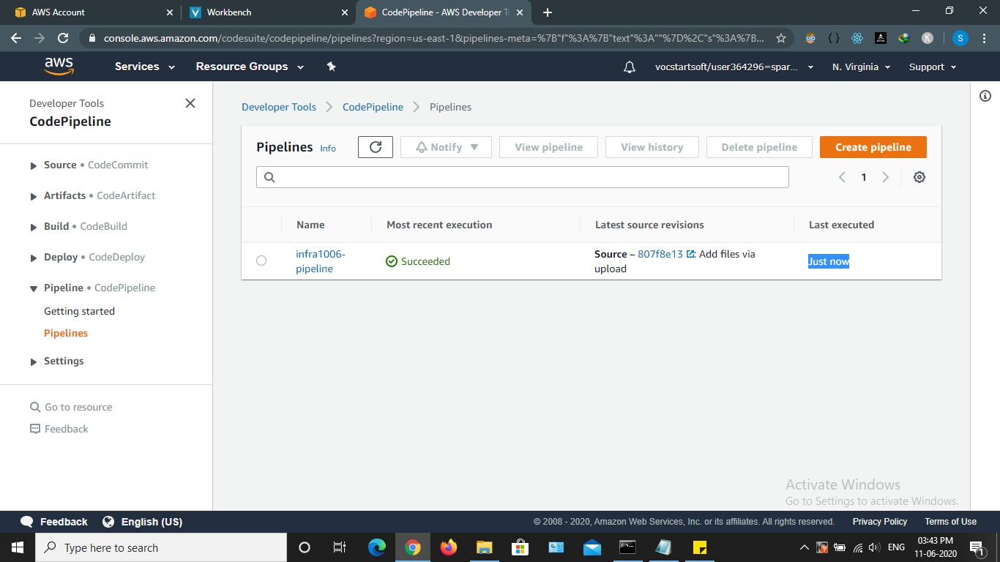
 

### At last here is the file for reference 
[`Infrastructure.tf`](https://github.com/Sparsh-Agrawal/Terraform-AWS-1/blob/master/infra.tf)
