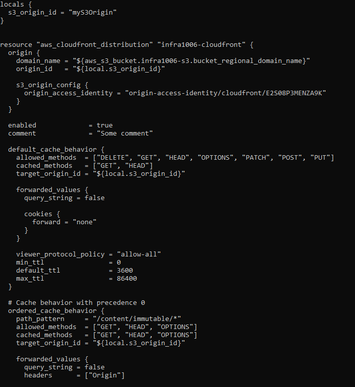
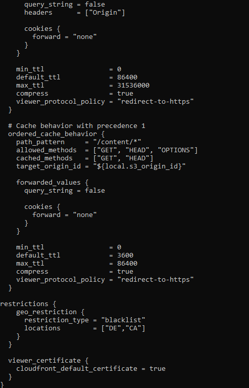

# Terraform-AWS-1
Terraform is an open-source tool created by **HashiCorp**. It is used for building, changing, and versioning infrastructure safely and efficiently. Terraform can manage existing and popular service providers as well as custom in-house solutions.

#### Statement
* Create the key and security group which allow the port 80.
* Launch EC2 instance.
* In this Ec2 instance use the key and security group which we have created in step 1.
* Launch one Volume (EBS) and mount that volume into /var/www/html
* Developer have uploded the code into github repo also the repo has some images.
* Copy the github repo code into /var/www/html
* Create S3 bucket, and copy/deploy the images from github repo into the s3 bucket and change the permission to public readable.
* Create a Cloudfront using s3 bucket(which contains images) and use the Cloudfront URL to  update in code in /var/www/html

### For starting

 

Here I have created a infrastructure in **HCL (Hashicorp Configuration Language)** which consists of 

### EC2 instance with configured Apache Server
  * Key Pair

  * Security Group

  * EBS Volume

  * Instance

### Hosted Site using the IP of the Instance

  
### S3 bucket with Public Access, consisting of all the data of GitHub repository
   * S3 bucket and Bucket Policy

   
### CloudFront Distribution for S3 bucket

 

### CodePipeline for fully managed continous delievery that automatically copy the updates or pushes of GitHub repository into S3 bucket respectively

 

 

 

 

 

 

 

### Clearing your Infrastructure

 

### For reference 
[`Infrastructure.tf`](https://github.com/Sparsh-Agrawal/Terraform-AWS-1/blob/master/infra.tf)

[`LinkedIn`](https://www.linkedin.com/pulse/aws-infrastructure-using-terraform-sparsh-agrawal)
